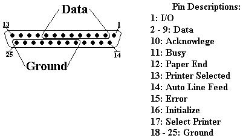

<div align="center">

## Parallel Port Programming LED's


</div>

### Description

This code will show you how to do basic parallel port programming. This particular example shows you how to light up LED's that are plugged into the parallel port.
 
### More Info
 


<span>             |<span>
---                |---
**Submitted On**   |2002-03-29 16:28:46
**By**             |[Element\-X Software Productions](https://github.com/Planet-Source-Code/PSCIndex/blob/master/ByAuthor/element-x-software-productions.md)
**Level**          |Beginner
**User Rating**    |4.9 (64 globes from 13 users)
**Compatibility**  |VB 6\.0
**Category**       |[Files/ File Controls/ Input/ Output](https://github.com/Planet-Source-Code/PSCIndex/blob/master/ByCategory/files-file-controls-input-output__1-3.md)
**World**          |[Visual Basic](https://github.com/Planet-Source-Code/PSCIndex/blob/master/ByWorld/visual-basic.md)
**Archive File**   |[Parallel\_P666383292002\.zip](https://github.com/Planet-Source-Code/element-x-software-productions-parallel-port-programming-led-s__1-33203/archive/master.zip)


### Source Code

```
I saw an article yesterday that was talking about parallel port programming in visual basic. However, this artical didn't contain any code nor did it really inform you as to much of anything about programming the parallel port. So, I wrote this short tutorial to introduce you to the basics of programming the parallel port. </p>
I plan on writing more advanced tutorials at a later date but this should get you started.
```

